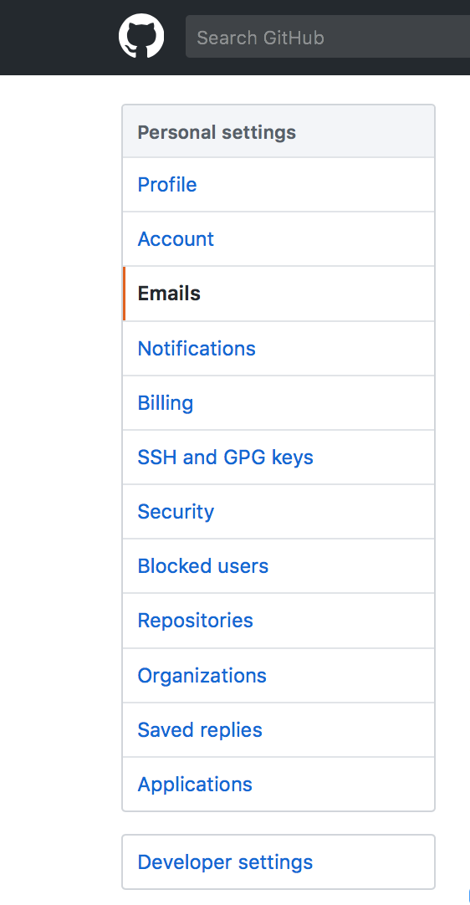
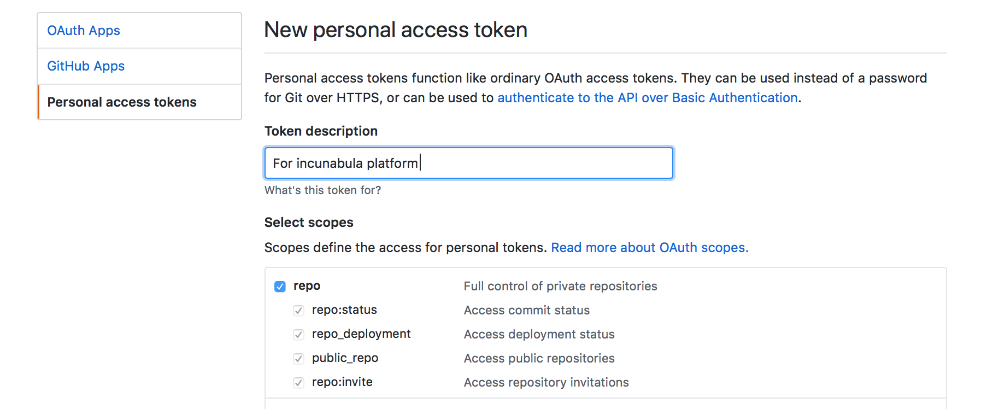
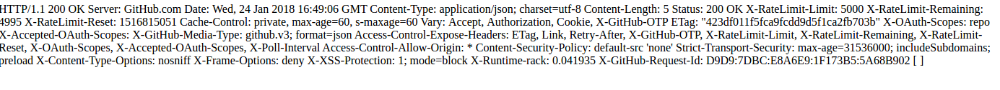

# Setting Up Incunabula

There are a number of things you have to do when setting up incunabula:
* specify the data directory
  * (unify the books dir and the data directory)
* set up the GitHub user and personal access token
* create the users from the command line

## The Data Directory

The config files in `config` have a setting called `data_dir`

This directory (which must exist) is where the data will be written. Inside the directory there must be 2 subdirectories:
* users/
* books/

The users database `users.db` will be created in 'users/'. Incunabula will create book directories in `books/`.

## Set up the GitHub organisation and secure keys

Incunabula uses GitHub as both a backup and **operator's console** that allows your tech staff to debug and investigate problems.

## Setup the GitHub user

This application uses a GitHub account for backup and stores the Personal Access Token (like a password but for computers) on the server.

Best practice is that you create a special GitHub account **for the server** (not for any individuals) and create your books on that

Once you have created an account you need to go to 'Settings' and select the `Developer Settings`

Once you are then select `Personal access token` and create a token with **only** the `repo` scope granted.

This will then disply a token **which you can only see once**. You need to copy that and store it. It goes into the configuration of your server. It goes in your config file as part of the `incunabula` `configuration` under the key `personal_access_token`.

You can test that your config is working by starting the application with a shell and then typing this command in the shell:

`Incunabula.Git.check_github_SHELL_ONLY()`

It will run a curl on the github api with the personal access token and you should see it working...

## Creating users from the command line

The dependency `incunabula_utilities` handles two things:

* the code to access the user database
* an escript to create new users from the command line

This escript is call `add_users`

To run it cd to the users database directory (that is the `users/` directory that is under the `data_dir` you specified in the config.

Then run `../path/to/add_users/add_users "Gordon Guthrie" "mypasswordthing"`

This will create a user database with passwords. You can change a password by running it with a different password.

Users can be deleted by editing the db (it is an Erlang term file and human readable).